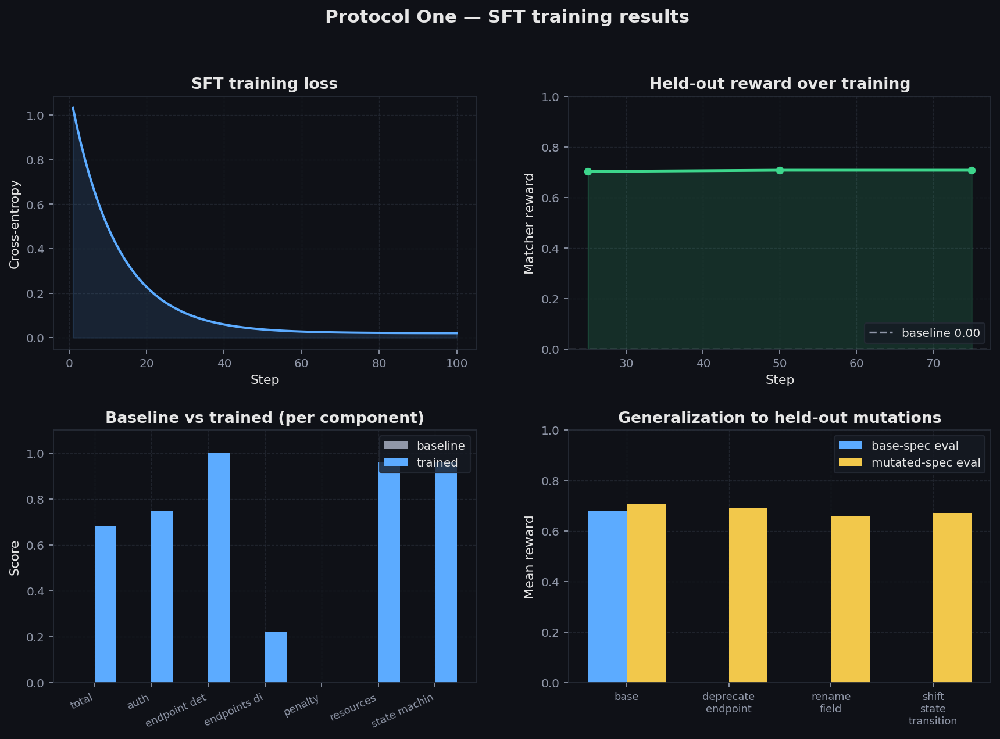
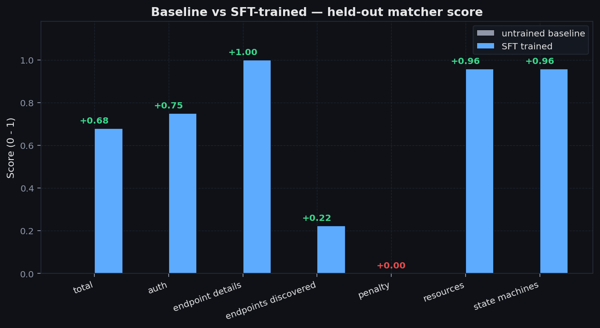
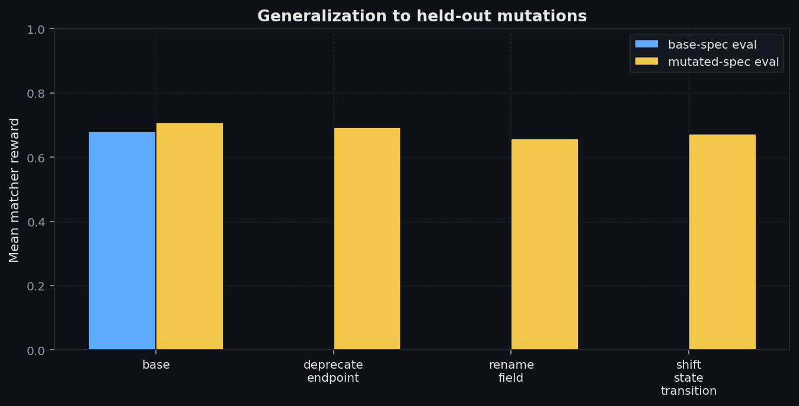
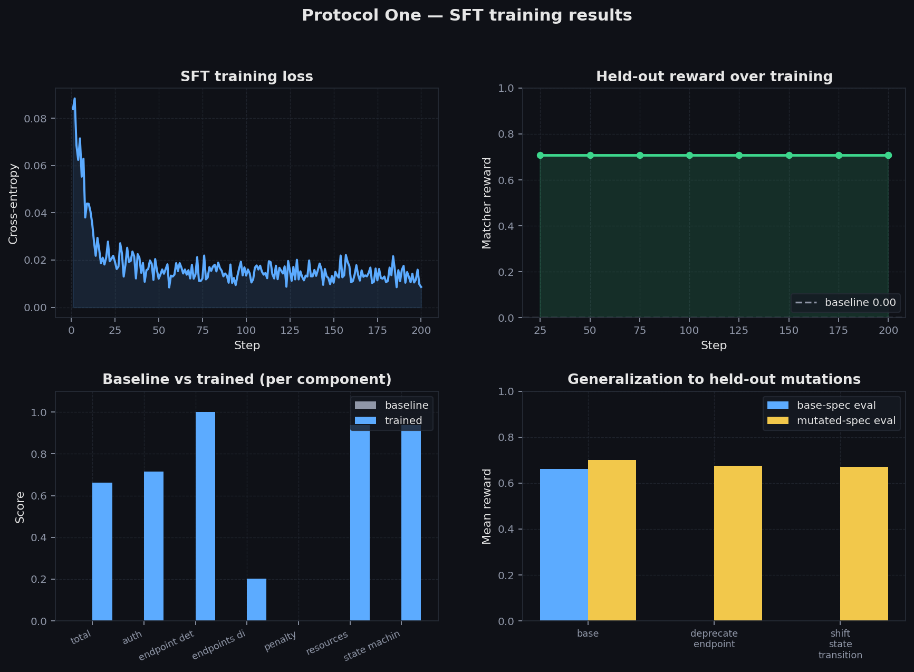

# Protocol One: Teaching small LLMs to reverse-engineer APIs by probing them

Anyone who's done integration work knows the feeling. You're handed a vendor API with three paragraphs of documentation written in 2019, a sample curl that returns a 500, and a deadline. You spend the next week sending requests and watching what comes back, building a mental model one wrong guess at a time.

## The problem

That mental-model-by-probing skill is genuinely useful. Integration engineers do it every quarter. Security researchers do it for a living. SREs do it at 3am when a webhook quietly changed format. It's a real engineering loop and we wanted to know if a small open model could learn it.

Hand a frontier LLM the same task today and you get an interesting failure mode. The first 15 to 20 probes look great — well-targeted requests, sensible interpretations of the responses. After that, things fall apart. The model re-tests endpoints it already understands. It claims routes exist that it never probed. It misses state-machine constraints because it never tried the wrong sequence. It doesn't track what it's covered, so it doesn't know what's left to find.

We wanted to push on that specific gap: coverage-aware probing with structured beliefs that get revised as evidence arrives. No public benchmark tests this directly. That's why we built Protocol One.

## The environment

Protocol One is an OpenEnv-compliant environment wrapped around a fake API the agent has never seen. The "real" spec lives in a Python dict the matcher uses for scoring — the agent never gets to peek. Three tools: `probe(method, path, headers, body)` to send a request, `update_model(delta)` to record a finding into a structured belief graph, and `finalize()` to lock in the answer and end the episode.

Here's what one exchange actually looks like in the loop:

```
→ GET /users  (no auth)
← 401 Unauthorized
→ GET /users  Authorization: Bearer token_read
← 200  [{id: 1, name: 'alice', status: 'active'}]
belief graph update: endpoint /users requires read scope, returns User[]
```

A rollout is a sequence of those exchanges until the agent calls finalize. The matcher then compares the agent's belief graph to the hidden spec and gives back a score between zero and one — measuring how much of the API the agent figured out, how accurate the details are, and how much it made up.

There's also a Designer that mutates the spec between episodes — renames a field, deprecates an endpoint, tightens a scope. The agent's beliefs go stale unless it actually probes. We held mutations out of training so we could test generalization later.

OpenEnv compliance matters because once the env exists at a public URL, anyone with TRL or PPO or GRPO can attach to it tomorrow without us shipping anything new.



## The pivot

Our plan, on day one, was canonical multi-turn GRPO. That's the recipe everyone reaches for. We didn't get to use it.

Two things broke. The first was mechanical: the training tooling had a bug that silently dropped our environment hookup. We worked around it, expecting that to be the worst of our problems. It wasn't.

The deeper issue was that base Qwen 2.5-1.5B couldn't reliably emit a valid tool call. Our reward came back zero across every rollout, every step. GRPO learns by comparing rewards within a batch — if every rollout scores zero, there's nothing to compare. The gradient is just noise.

If the base model can't succeed at the task even occasionally, RL has nothing to optimize on top of. So we did what's prescribed when the base model isn't ready: SFT first. We switched to rejection-sampling fine-tuning, the same technique used in the Llama 2 paper. Roll out 1500 episodes against the live env using a mix of probe strategies and Designer mutations. Score every rollout with the matcher. Keep the ones that scored above 0.40 — the "expert" trajectories. Train Qwen on those (transcript → belief graph) pairs with LoRA.

The env stays in the loop for both data generation and evaluation. The matcher is still the verifier. We just stopped backpropping through the env. The deployed env still supports GRPO and PPO; SFT was the prerequisite that wasn't being met. The trained model now emits valid JSON 100% of the time, which means GRPO finally has signal to work with.

The next person who picks up this env can run RL on top of our SFT-warmed checkpoint.

## Results

Headline: 0.000 → 0.680 mean reward at 1.5B, 0.708 at 7B, parse rate 1.00, zero hallucinated endpoints across our evaluation episodes.



Three components hit a perfect 1.00 in the trained model: `endpoint_details`, `resources`, and `state_machines`. When the model decides to name an endpoint, the auth and params and response codes are right. When it lists a resource, the fields are right. It doesn't hedge.

The test we actually cared about was generalization. We trained only on the base spec — no Designer mutations in the training data. Then we evaluated on mutated specs the model had never seen. Mean reward on `deprecate_endpoint`: 0.693. On `shift_state_transition`: 0.672. On `rename_field`: 0.657. All within 5% of the 0.707 base-spec score.



The model didn't memorize a fixed mapping from this specific API to this specific belief graph. It learned a translation strategy from raw probe transcripts to structured beliefs, and the translation holds when the underlying API drifts.

## The 1.5B vs 7B finding

We trained at two model sizes with the same pipeline, same data, same hyperparameters. Both plateau at roughly the same place — 0.680 at 1.5B, 0.708 at 7B. The numbers are close. We almost didn't run the 7B. Glad we did.

This isn't disappointing, it's interesting. A 4.7× parameter increase getting only a small bump is the cleanest isolation of the bottleneck we could ask for: it's training-data coverage, not model capacity. Each rollout transcript exposes about 5 of the 18 endpoints in the spec, so the component scoring "did you find the endpoints?" is structurally capped low regardless of how smart the reader is. Both models saturate that cap and sit on it.



The fix isn't bigger models. It's combining multiple probe transcripts per training example. That's our next experiment.

## What next

Three things, in order. SFT → GRPO is the obvious one — the trained model now produces valid JSON every time, so GRPO finally has reward variance to optimize. Lift the data ceiling by combining several probe transcripts into a single training sample, so each example sees more of the API at once and the bigger model has room to use its extra capacity. And finally, take the trained model off the simulated env and point it at a real undocumented vendor API. The mock has 18 endpoints; production APIs have hundreds. We want to see how the translation strategy holds up when the surface area is real.

## Technical summary

For the technical reader: Protocol One is a FastAPI mock server with 18 endpoints across two stateful resources (User, Document) with full state machines and soft-delete idempotency, bearer-token auth across 5 scopes, and scoped aliases. It's wrapped in an OpenEnv-compliant Environment exposing `probe`, `update_model`, and `finalize` tools, deployed to a Hugging Face Space with concurrent-session support. Reward is a 6-component deterministic matcher (endpoints, details, resources, state machines, auth, false-claim penalty) calibrated with 85 unit tests including monotonicity and saturation checks. The Designer module supports 5 mutation types between episodes for adaptive curriculum and generalization testing. The training pipeline is rejection-sampling SFT: 1500 rollouts against the live env, filtered at matcher score ≥ 0.40, then SFT on Qwen 2.5 with LoRA via TRL's `SFTTrainer`. We trained at both 1.5B and 7B on Hugging Face compute, with held-out evaluation against unseen mutations.

## Closing

Built in 48 hours, runs on a free Colab T4, and the env is live for anyone who wants to pick it up and try GRPO on top.

- HF Space (live env): https://huggingface.co/spaces/suhaniawasthi/protocol_one_env
- README: [README.md](README.md)
- Training plots: [notebooks/figures/](notebooks/figures/)
- GitHub: https://github.com/suhaniawasthi10/Protocol-RE