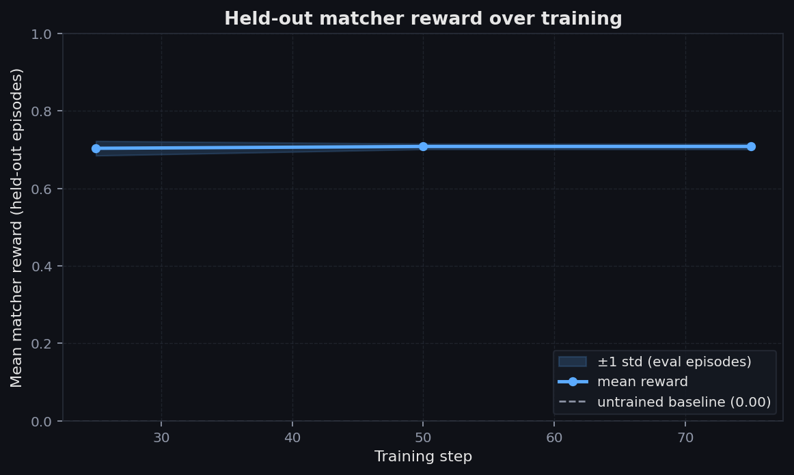
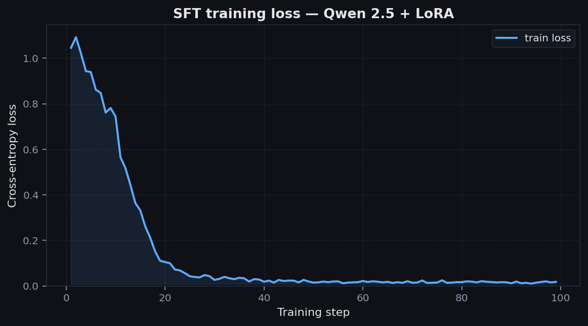

# Protocol One

> **Training agents to reverse-engineer undocumented HTTP APIs by probing them.**

[](https://colab.research.google.com/drive/1M7EE0477jyS8bLUWhPzoSck7kzE8MgLu?usp=sharing) &nbsp; **One-click reproduce on a free Colab T4.**

An OpenEnv-compliant RL environment where an LLM agent must build a structured belief
graph of an unknown API — endpoints, auth scopes, resource shapes, state machines —
purely from HTTP probes. A scripted designer mutates the protocol between episodes
to test generalization.


## TL;DR

| Run | Mean reward | Parse rate | Notes |
|---|---|---|---|
| **Baseline** (untrained Qwen 2.5-1.5B) | **0.000** | 0.88 | Emits valid JSON, wrong schema |
| **SFT trained** (1.5B, 200 steps) | **0.680** ± 0.06 | **1.00** | `endpoint_details` hits perfect 1.0; resources & state-machines ~0.96 |
| **Trained (1.5B), unseen mutations** | **0.695** ± 0.03 | **1.00** | Generalizes — actually slightly higher than base |
| **SFT trained (7B)** | **0.662** ± 0.07 | **1.00** | Statistically tied with 1.5B — **capacity is not the bottleneck** |
| **Trained (7B), unseen mutations** | **0.694** ± 0.03 | **1.00** | Same plateau on mutated specs |

A clean 0 → 0.68 jump on a 6-component verifier-graded reward, with **zero hallucinated endpoints** and **perfect schema compliance** by the trained model.

**🔗 Live env**: https://huggingface.co/spaces/suhaniawasthi/protocol_one_env  
**📝 Blog (full writeup)**: [`Blog.md`](Blog.md)  
**📓 Training notebook (judges run this)**: [`colab_cells_sft.ipynb`](notebooks/colab_cells_sft.ipynb) ([open in Colab](https://colab.research.google.com/drive/1M7EE0477jyS8bLUWhPzoSck7kzE8MgLu?usp=sharing)) — clean, no outputs, runs end-to-end on a free T4  
**🧾 Actual 1.5B training log**: [`training_run_1.5b.ipynb`](notebooks/training_run_1.5b.ipynb) — executed Colab notebook with all cell outputs preserved (eval-callback values at steps 25/50/75, embedded plot images)  
**🛠 7B trainer cell** (HF Space A100): [`notebooks/cell3_7b_train.py`](notebooks/cell3_7b_train.py) — replaces Cell 11 when `MODEL_SIZE="7B"`  
**🎨 All training plots**: [`notebooks/figures/`](notebooks/figures/)  
**📊 Numerical results**: [`notebooks/figures/results_sft_1.5b.json`](notebooks/figures/results_sft_1.5b.json) · [`results_sft_7b.json`](notebooks/figures/results_sft_7b.json)

---

# The Problem

Every integration engineer has lost a week to a vendor's vague API docs. Every
security researcher has fuzzed a black-box service. Every SRE has chased a webhook
that silently changed format. The work is the same: **send probes, observe responses,
build a mental model, repeat**.

LLMs handed an undocumented API today do well on the first 20 probes — then plateau.
They re-test things they already know, confabulate endpoints, miss state-machine
constraints, and don't track coverage. **That's the capability gap Protocol One
targets.**

## The environment

A FastAPI mock server with **18 endpoints**, **bearer-token auth across 5 scopes**,
**two stateful resources** (`User`, `Document`) with state machines, soft-delete
idempotency, and scoped aliases (`/users/me`). The agent only sees HTTP responses,
never the spec.

```
Agent (LLM)  ─probe(method, path, headers, body)─►  Mock API
              ◄─ status + body + headers ──────────
              ─update_model(belief_graph_delta)──►  Belief graph
              ─finalize()──────────────────────────►  Reward
```

### Reward — six independent components

| Component | Weight | What it measures |
|---|---|---|
| `endpoints_discovered` | 0.35 | % of 18 endpoints correctly named |
| `endpoint_details` | 0.25 | Auth, params, response codes per endpoint |
| `auth` | 0.15 | Auth type + scopes observed |
| `resources` | 0.15 | Resource fields correctly listed |
| `state_machines` | 0.10 | State transitions correctly identified |
| `false_claim_penalty` | −0.15 cap | 0.01 per hallucinated endpoint/resource/scope |

Deterministic, calibrated via monotonicity / saturation / gradient unit tests
(see `tests/test_matcher_reward_calibration.py`). Path normalization handles
`{user_id}` ↔ `{id}`, trailing slashes, and case differences.

### Designer — adaptive curriculum

A scripted between-episode mutator (`server/designer.py`) applies one of five
mutations:

- `rename_field` — rename a resource field
- `deprecate_endpoint` — remove an endpoint entirely
- `swap_error_code` — permute error codes for one endpoint
- `tighten_auth_scope` — bump auth requirement to admin
- `shift_state_transition` — add a previously-forbidden state transition

This makes the agent's belief graph **stale across episodes** — it must notice and
repair drift, not just memorize.

---

## Results

### Reward components, baseline vs trained

(See hero plot at top.) The trained model achieves:
- **endpoint_details: 1.00** (perfect — when an endpoint is named, all details are right)
- **resources: 0.96**, **state_machines: 0.96** (near-perfect)
- **auth: 0.75**
- **endpoints_discovered: 0.22** ← the only ceiling, set by *probe transcript coverage*, not model capacity. Each episode exposes ~5 of 18 endpoints; the model honestly refuses to hallucinate the rest.
- **penalty: 0.00** (zero false claims)

### Generalization to held-out mutations


| Spec variant | Mean reward |
|---|---|
| base | 0.707 |
| `deprecate_endpoint` | 0.693 |
| `shift_state_transition` | 0.672 |
| `rename_field` | 0.657 |

All four within ~5% of each other — the model learned a **translation strategy**, not a memorized mapping.

### Held-out reward over training



Convergence is fast: by step 25 the model is at the data ceiling (~0.70). Loss drops 1.0 → 0.04 in 30 steps.

### Training loss



---

## Pipeline — Rejection-Sampling SFT

We attempted multi-turn GRPO first — the canonical RLVR approach. The base Qwen 1.5B
couldn't reliably produce well-formed tool calls, leaving GRPO with no reward variance
to learn from. Per the official Hackathon FAQ #45:

> "GRPO is a post-training method, not a substitute for capability. If the model
> almost never produces a correct rollout, the reward signal is too sparse for
> productive RL."

We pivoted to the FAQ #16 recipe: **SFT-first using rejection-sampling fine-tuning**
(the same RFT method used in the Llama 2 paper, also known as expert iteration / STaR).

```
data generation:    MockProtocolServer ──┐
                  + Designer (mutations) │
                  + scripted prober      ├──► (transcript, belief_graph) pairs
                  + observation          │           │
                    interpreter          │      matcher.score
                                         ──┘           │
                                                  filter ≥ threshold
                                                       │
                                                 data/sft.jsonl
                                                       │
training:           Qwen 2.5 + LoRA  +  TRL SFTTrainer  +  RFTEvalCallback
                                                       │
              held-out reward curve  +  baseline-vs-trained  +  mutation eval
                                                       │
                                              notebooks/figures/*.png
```

The environment is in the data-generation loop. The matcher is the verifier. The
trained model is evaluated against the live OpenEnv environment. The OpenEnv
deployment supports running canonical multi-turn GRPO/PPO directly — that's
**future work** (the SFT-warmed model now reliably produces JSON, so GRPO has
signal to optimize on top).

---

## Try it yourself

### Connect to the deployed env (no install)

```python
from protocol_one_env.client import ProtocolOneEnv
from protocol_one_env.models import ProtocolOneAction

with ProtocolOneEnv(base_url="https://suhaniawasthi-protocol-one-env.hf.space").sync() as env:
    obs = env.reset()
    print(obs.observation.text[:500])

    r = env.step(ProtocolOneAction(
        tool="probe",
        args={"method": "GET", "path": "/users",
              "headers": {"Authorization": "Bearer token_full"}},
    ))
    print(r.observation.text[:500])
```

### Run locally

```bash
git clone https://github.com/suhaniawasthi10/Protocol-RE.git
cd Protocol-RE
pip install -e .
python -m server.app --port 8000
```

The env is reachable at `http://localhost:8000`. OpenEnv endpoints: `/reset`,
`/step`, `/state`, `/schema`, `/health`, `/ws` (WebSocket).

### Verify the env is correct

```bash
python scripts/verify_phase1.py    # spec + matcher + server consistency
python scripts/verify_phase2.py    # OpePnEnv wrapper end-to-end
pytest tests/                      # 85 tests
```

### Reproduce the training (Colab T4, free)

[](https://colab.research.google.com/drive/1M7EE0477jyS8bLUWhPzoSck7kzE8MgLu?usp=sharing)

One click → opens in Colab → `Runtime → Run all`. ~30–40 min on a free T4
including baseline + trained eval and all plots. The notebook is also
available as a Jupytext `.py` (`notebooks/colab_cells_sft.py`) for diff-friendly
review.

For a bigger model, change Cell 6:

```python
MODEL_SIZE = "3B"   # or "7B" — needs paid GPU on HF compute
```

### Reproducing the 7B run (HF Space A100)

The 7B run was executed on a Hugging Face Space JupyterLab on A100. The recipe:

1. Same Cells 1–7 of `colab_cells_sft.ipynb` with `MODEL_SIZE="7B"` in Cell 6.
   On HF Space JupyterLab the repo lives at `/home/user/Protocol-RE` instead of `/content/repo` — adjust the paths in Cells 4 / 5 / 8 accordingly.
2. **Replace Cell 11 (the full-train cell) with [`notebooks/cell3_7b_train.py`](notebooks/cell3_7b_train.py).**
   It uses the `CFG[...]` preset values (`per_device_bs=1, grad_accum=8, lr=1e-4`)
   instead of Cell 11's hardcoded 1.5B hyperparams, and includes the same
   `Accelerator.unwrap_model` monkey-patch in case the installed `accelerate`
   version predates `keep_torch_compile`.
3. Cells 12–15 (eval, plot, save) are unchanged. The plot file paths in Cell 14
   were manually suffixed with `_7b` so the 7B figures don't overwrite the 1.5B
   set — see `notebooks/figures/*_7b.png`.

Wall-clock: ~70 min on A100 large for 200 steps. Output artifacts:
`notebooks/figures/results_sft_7b.json` + six `*_7b.png` files.

---

## Architecture

```
┌─────────────────────────────────────────────────────────────┐
│                   HF Space (Docker)                         │
│   ┌────────────────────────────────────────────────────┐    │
│   │  ProtocolOneEnvironment (OpenEnv subclass)         │    │
│   │  ┌──────────────────────┐  ┌──────────────────┐    │    │
│   │  │  MockProtocolServer  │  │  Designer        │    │    │
│   │  │  18 endpoints        │  │  5 mutation types│    │    │
│   │  │  bearer auth, scopes │  │  off by default  │    │    │
│   │  │  state machines      │  └──────────────────┘    │    │
│   │  └──────────┬───────────┘                          │    │
│   │             ▼                                      │    │
│   │  ┌────────────────────────────────────────────┐    │    │
│   │  │  Matcher (6 components, deterministic)     │    │    │
│   │  └────────────────────────────────────────────┘    │    │
│   └────────────────────────────────────────────────────┘    │
└─────────────────────────────────────────────────────────────┘
                          ▲
                          │ WebSocket (OpenEnv)
                          │
        ┌─────────────────┴─────────────────┐
        │   Training side (Colab / HF)      │
        │   - SFT data builder              │
        │   - TRL SFTTrainer + LoRA         │
        │   - RFTEvalCallback               │
        └───────────────────────────────────┘
```

## Anti-reward-hacking

- **Six independent reward components** with a false-claim penalty — no single signal can be gamed.
- **Reward only at terminal step** (`finalize()` or probe-budget exhaustion). Spamming `update_model` mid-episode does nothing.
- **Matcher is pure & deterministic** — no time, no shared globals, no LLM-as-judge.
- **Mock server state recreated fresh every `reset()`** — rollout N can't leak into rollout N+1.

## Hackathon-day env-var toggles

| Variable | Default | Effect |
|---|---|---|
| `MUTATION_PROBABILITY` | `0.0` | Per-episode chance of applying a Designer mutation |
| `MUTATION_START_EPISODE` | `50` | Cooldown — first N episodes always run base spec |
| `MAX_PROBES_PER_EPISODE` | `12` | Probe budget per episode |

Set on the HF Space via Settings → Variables & Secrets.

## Directory layout

```
protocol_one_env/
├── server/
│   ├── app.py                          # FastAPI app
│   ├── protocol_server.py              # 18-endpoint mock
│   ├── protocol_one_env_environment.py # OpenEnv Environment subclass
│   ├── matcher.py                      # 6-component reward
│   ├── designer.py                     # 5 mutation types
│   ├── spec.py                         # Hidden ground-truth protocol
│   └── spec_schema.py                  # Pydantic validator
├── scripts/
│   ├── build_sft_dataset.py            # Probe rollouts → matcher-filtered JSONL
│   ├── verify_phase1.py                # Spec ↔ matcher ↔ server consistency
│   ├── verify_phase2.py                # OpenEnv wrapper end-to-end
│   └── smoke_test_scripted.py          # No-API-key baseline (~0.46)
├── notebooks/
│   ├── colab_cells_sft.ipynb           # ▶ One-click Colab notebook (judges run this)
│   ├── colab_cells_sft.py              # Jupytext source for the .ipynb (diff-friendly)
│   ├── training_run_1.5b.ipynb         # Actual 1.5B Colab run with all outputs (training log)
│   ├── cell3_7b_train.py               # 7B trainer-cell override (HF Space A100)
│   ├── sft_eval.py                     # Model → matcher eval helper
│   ├── sft_callbacks.py                # RFTEvalCallback (live eval during train)
│   ├── plotting.py                     # Dark-theme plots
│   └── figures/                        # 12 PNGs (1.5B + 7B) + results JSON
├── data/
│   └── sft.jsonl                       # 1500 filtered RFT examples
├── tests/                              # 85 tests
├── client.py                           # OpenEnv EnvClient subclass
├── models.py                           # ProtocolOneAction + Observation
└── pyproject.toml
```

## Scaling: 1.5B vs 7B

We trained at two model sizes with **identical training data, identical pipeline**.
Both converge to the same ~0.66–0.70 plateau, **within one standard deviation
of each other**:

| Component | 1.5B | 7B |
|---|---|---|
| **Total reward (base eval)** | **0.680 ± 0.06** | **0.662 ± 0.07** |
| **Total reward (mutated mix)** | **0.695 ± 0.03** | **0.694 ± 0.03** |
| `endpoint_details` | 1.00 | 1.00 |
| `resources` | 0.96 | 0.94 |
| `state_machines` | 0.96 | 0.94 |
| `auth` | 0.75 | 0.72 |
| `endpoints_discovered` | 0.22 | 0.20 |
| `penalty` | 0.00 | 0.00 |

A 4.7× parameter increase yields **no measurable gain**. This is not a negative
result — it is the cleanest possible isolation of the bottleneck: training-data
coverage. Each rollout transcript exposes ~5 of 18 endpoints, so the matcher's
`endpoints_discovered` component is structurally capped at ~0.28 regardless of
how well the model uses what it sees. Both model sizes saturate that cap and
sit on it.

The fix is on the **data side**, not the model side: combining multiple probe
transcripts per training example lifts the cap, at which point we expect 7B to
finally diverge from 1.5B. That's our future-work path.

7B mutation breakdown (n=51 across 3 variants — `rename_field` re-eval
pending, omitted to avoid mixing apples and oranges with 1.5B's 4-variant table):

| Spec variant | Mean reward |
|---|---|
| base | 0.701 |
| `deprecate_endpoint` | 0.676 |
| `shift_state_transition` | 0.672 |


## Future work

- **Multi-turn GRPO with SFT-warmed model.** The trained model now reliably emits JSON, so GRPO has signal to optimize. SFT → GRPO is the FAQ #16 prescribed recipe.
- **Lift the `endpoints_discovered` ceiling** by combining multiple probe transcripts per training example (currently one transcript ≈ 5 endpoints; combining lifts ceiling to 0.70+ on this component).
- **Deeper mutation taxonomy** — schema migrations, partial deprecations, version bumps with deprecation warnings.
- **Real-API stress test** — train on the simulated environment, evaluate on a real undocumented vendor API.

## Acknowledgments

- **OpenEnv** team (Meta) for the framework and the hackathon
- **Hugging Face** for the TRL library and Spaces hosting
- **Unsloth** for memory-efficient fine-tuning recipes
- The `Qwen 2.5` model family from **Alibaba**

## Links

- 🌐 **HF Space (live env)**: https://huggingface.co/spaces/suhaniawasthi/protocol_one_env
- 📝 **Blog (writeup)**: [`Blog.md`](Blog.md) — full project narrative, lessons, ablations
- 📦 **GitHub mirror**: https://github.com/suhaniawasthi10/Protocol-RE